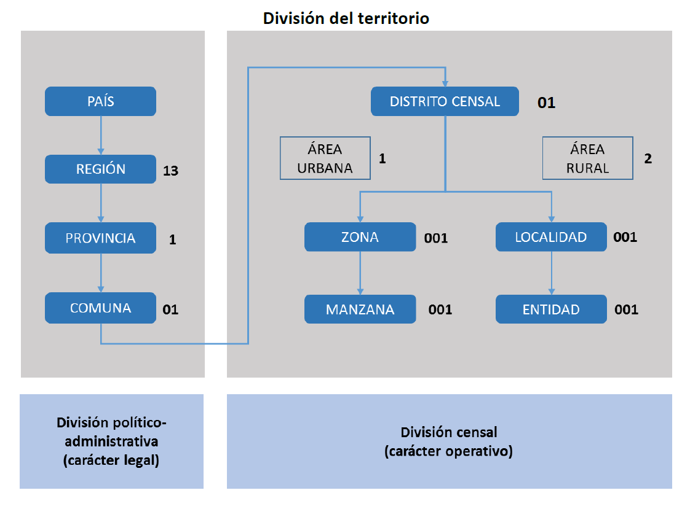

# Documentación Calculo de Indicadores Socioeconómicos

El objetivo de este documento es explicar el procesamiento de datos y el cálculo de indicadores socioeconómicos a partir del Censo de Población y Vivienda de 2017 realizado por el INE.

El enfoque es lograr construir cartografías que representen esta información en el territorio nacional.

## Estructura de la información

En esta sección se describen la estructura de la información del censo: tanto la geográfica como la poblacional.

### Información Geográfica

Manzanas y Entidades

Zonas Censales

#### Códigos y división censal

#### Urbano y Rural

#### Indeterminación Estadística

Indeterminación

Multipolígonos

Referencia: documento ine en docs

### Información poblacional

#### Tabla Personas

#### Tabla Hogares

#### Tabla Vivienda

## Obtención de datos

### Descarga 

Documentación

* Manual de usuario censo: https://redatam-ine.ine.cl/manuales/Manual-Usuario.pdf

* Alcances base cartográfica censal: http://www.censo2017.cl/servicio-de-mapas/descargas/mapas/alcances-base-cartografica-censo2017.pdf

Fuentes de datos

* Manzanas urbanas:

* Entidades rurales:

* Zonas Censales:

* Localidades:

* Microdatos: 

<!--html_preserve-->

<!--/html_preserve-->

### Paquete Censo2017

## Vinculación de información

Diagrama Proceso Cálculo Indicador:

<!--html_preserve-->

<!--/html_preserve-->

* Agregación información poblacional

* Asociación a código geográfico

* Cartografía

## Indicadores Socioeconómicos

Trabajo sobre zonas censales

### IRH: Indicador de Resilencia de Hogares

Tipos de hogares no monoparentales

$$ 
\sum_{i=1}^{N} x_i   
$$ 

### IEJ: Indicador de escolaridad del jefe de hogar

### IPJ: Indicador de Participación Juvenil

Inverso NINI

### IEM: Indicador de Empleo

### ISV: Indicador de Suficiencia de la Vivienda

Hacinamiento

Ojo con vivienda informal

### IVI: Indicador de Calidad de la Vivienda

## Referencias

* INE 2018: Alcances base cartográfica censal: http://www.censo2017.cl/servicio-de-mapas/descargas/mapas/alcances-base-cartografica-censo2017.pdf

* INE 2018: Manual de usuario censo: https://redatam-ine.ine.cl/manuales/Manual-Usuario.pdf

